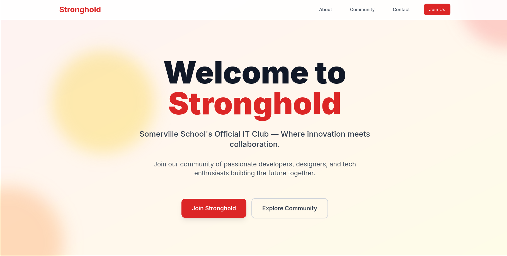

<h1 align="center">💻 Stronghold IT Club Website</h1>

<p align="center">
  Official website for <b>Stronghold IT Club</b>, Somerville School's premier technology community.
</p>

<p align="center">
  
</p>

---

## 🏗️ Project Structure

```
Stronghold/
├── index.html              # Main homepage
├── pages/
│   └── singularity.html    # Singularity competition page
├── assets/
│   ├── css/
│   │   └── styles.css      # Custom styles and animations
│   └── js/
│       └── script.js       # Interactive functionality
├── package.json            # Project configuration
├── LICENSE                 # MIT License
└── README.md              # This file
```

---

## 🚀 Features

### 🌐 Main Website (`index.html`)
- 🎥 **Hero Section**: Animated background with call-to-action  
- 🔢 **Stats Counter**: Live counter animation showing volunteer count  
- 📝 **About Section**: Mission and values  
- 👥 **Community Section**: Discord and GitHub integration  
- 📩 **Contact Form**: Centralized contact form  
- 📱 **Responsive Design**: Mobile-first approach  

### 🏆 Singularity Page (`pages/singularity.html`)
- ℹ️ **Competition Information**: Complete event details  
- 📝 **Registration System**: Team registration form  
- 🏅 **Prize Structure**: Detailed prize breakdown (₹50,000 total)  
- ⏰ **Event Schedule**: Hour-by-hour timeline  
- ❓ **FAQ Section**: Comprehensive Q&A  
- 📂 **Resource Downloads**: Brochure and documentation  

---

## 🎨 Technology Stack

- 💻 **Frontend**: HTML5, CSS3, JavaScript ES6+  
- 🎨 **Styling**: Tailwind CSS, Custom CSS animations  
- 🔗 **Icons**: Font Awesome 6  
- ✍️ **Typography**: Inter font family  
- 🎬 **Animations**: CSS keyframes, Intersection Observer API  

---

## 🔗 Important Links

- 📦 **GitHub Repository**: [Stronghold Repo](https://github.com/Aarav2709/Stronghold)  
- 💬 **Discord Server**: [Join Here](https://discord.gg/DtGP2MkSNx)  
- 🏆 **Competition Page**: `pages/singularity.html`  

---

## 📱 Navigation

The website uses a clean navigation structure:

- 🏠 **Home**: Main landing page with club information  
- 📝 **About**: Club mission and values  
- 👥 **Community**: Discord and GitHub links  
- 📩 **Contact**: Contact form and information  
- 🏆 **Singularity**: Dedicated competition page  

---

## 🛠️ Development

To run locally:

```bash
# Clone the repository
git clone https://github.com/Aarav2709/Stronghold.git

# Navigate into the project
cd Stronghold

# Open index.html in a browser
```

For the Singularity page, open:  
```bash
pages/singularity.html
```

---

## 📄 License

This project is licensed under the MIT License – see the [LICENSE](LICENSE) file for details.  

---

## 🤝 Contributing

Built with ❤️ by Stronghold members. Contributions are welcome!  

---

<p align="center"><b>Stronghold IT Club</b> – Building the future of technology, one project at a time.</p>
